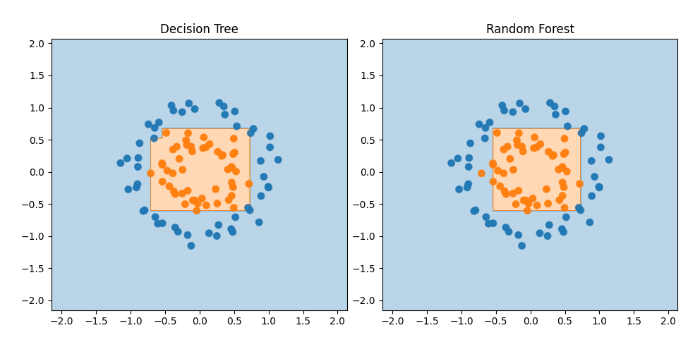

# Decision Tree

## Classifier

There is minimalistic realization of Decision Tree on C++ which can be also used as python module
- [x] All the realization of the tree in __src/Tree.*__

- [x] The src/py_module.cpp is necessary for building a python module from it using boost::python
- [x] There are some tests in main.cpp, which can be ran by uncommenting add_executable in CMakeLists.txt

- [x] Dynamic library module/decision_tree.so acts like a python module, so, for example, being in the same folder with it, you can import it using
```
import decision_tree as tree
```
or
```
from decision_tree import decision_tree_classifier
```
etc.

- [ ] I plan to add some numpy support


- [x] You can look at the examples in corresponding folder. Here's one:

  
- [ ] With much noise this model used to retrain, so it would be good to add some "regularizers". But I'm too lazy :P